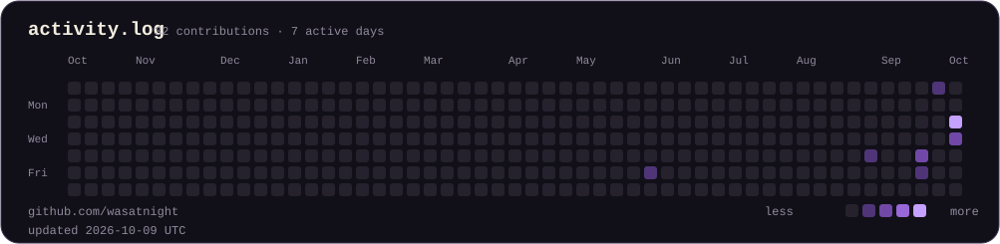

<div align="center">
  <a href="https://github.com/wasatnight">
    
  </a>
</div>

<br>

```text
ivan@pachuca:~$ ./about --short
```

I build practical software with an eye for clear interfaces and useful outcomes. My work sits between backend engineering, product thinking, and digital design—from local-AI desktop tools to responsive web products.

- Based in **Pachuca, Mexico** · available for remote opportunities
- Working with **Python, FastAPI, PostgreSQL, JavaScript, HTML/CSS, and AI integrations**
- Interested in backend, full-stack, automation, and product-focused software roles

```text
ivan@pachuca:~$ ls ./selected-work
```

| Project | What it does | Stack | Status |
| :-- | :-- | :-- | :-- |
| **[SupportFlow AI](https://github.com/wasatnight/supportflow-ai)** | Desktop customer-support system with a REST API, PostgreSQL persistence, and local AI suggestions with human review. | `Python` `FastAPI` `PySide6` `PostgreSQL` `Ollama` | Public |
| **[CiberPráctico](https://ciberpractico.com)** | Practical cybersecurity education for freelancers and small businesses, including an interactive learning experience. | `HTML` `CSS` `JavaScript` `Node.js` | Live |
| **[Grupo SI](https://gruposichih.com.mx)** | Responsive real-estate platform with property discovery, filters, listing pages, and direct contact paths. | `JavaScript` `TypeScript` `Supabase` | Live |
| **[TrackBet](https://github.com/wasatnight/trackbet-desktop)** | Desktop tracker for bankroll, ROI, straight bets, and parlays. | `React` `FastAPI` `SQLite` | Work in progress |

```text
ivan@pachuca:~$ cat ./toolbox
```

```text
BACKEND      Python · FastAPI · PostgreSQL · SQLAlchemy · REST APIs
FRONTEND     JavaScript · HTML5 · CSS3 · React
AI           Local models · Ollama · AI-assisted workflows
PRACTICE     Git · GitHub Actions · pytest · product-minded design
```

```text
ivan@pachuca:~$ ./contributions --year=current
```

<div align="center">
  
</div>

<sub>The activity graphic is generated inside this repository from GitHub's public contribution data and refreshed automatically—no third-party stats service.</sub>

```text
ivan@pachuca:~$ ./connect
```

[GitHub](https://github.com/wasatnight) · [SupportFlow AI](https://github.com/wasatnight/supportflow-ai) · [CiberPráctico](https://ciberpractico.com) · [Grupo SI](https://gruposichih.com.mx)

<!--
Portfolio and LinkedIn are intentionally omitted until their public URLs are verified.
Add them to the connect line above once available.
-->

<div align="center">
  <sub>Software Developer &amp; Digital Designer · building useful things with code and visual intent.</sub>
</div>
